**Nombre Estudiante 1:** Luis Enrique Garcia Gutierrez
**Carnet Estudiante 1:** 202010814

**Nombre Estudiante 2:** Nataly Saraí Guzmán Duarte
**Carnet Estudiante 2:** 202001570

# Manual Tecnico 

## Clase parent
- Se utilizo las siguientes librerias: stdio.h, stdlib.h, unistd.h, fcntl.h, time.h, sys/types.h, sys/wait.h, signal.h, string.h, sys/mman.h, sys/stat.h. Estas bibliotecas proporcionan funciones y macros para manipulación de archivos.

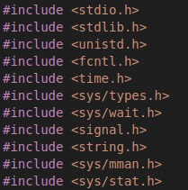

- Luego define constantes y variables globales como lo es : LOG_FILE y DATA_FILE que se utiliza para archivos asi se puede registrar las llamadas al sistema y datos. Y las variables globales para llevar registro de los contadores.

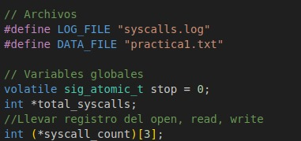

- La funcion handle_sigint establece la variable stop a 1 para señalizar que se realizo el control + c.

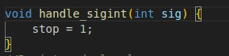

- La funcion log_syscall abre el archivo syscalls.log y escribe una entrada con el PID del proceso, la llamada al sistema y la marca de tiempo actual.

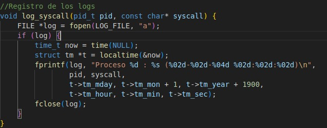

- La funcion main primero asocia la señal SIGINT con la función handle_sigint; luego limpia los archivos; luego continua creando la memoria compartida, usa shm_open, ftruncate y mmap para crear y mapear memoria compartida que será utilizada por los procesos para compartir el conteo de llamadas al sistema y luego inicializa los Contadores de Llamadas al Sistema: Establece total_syscalls y syscall_count a 0.

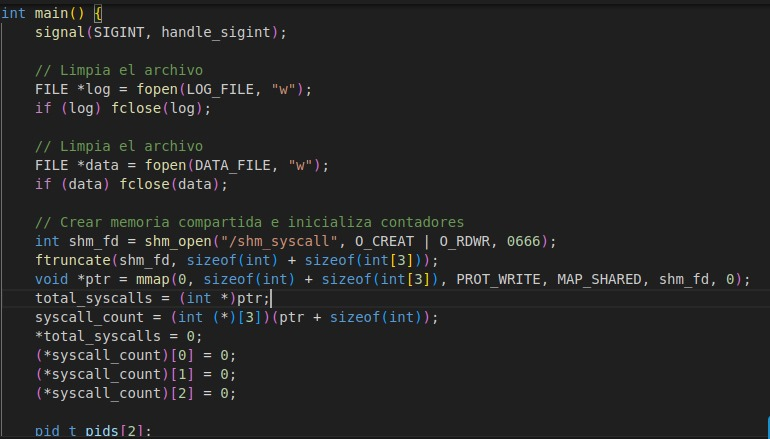

- Crea y ejecuta los procesos hijo ya que son 2 utilizamos un for, utiliza fork para crear dos procesos hijo, luego ejecuta el código del hijo, si execl falla, imprime un mensaje de error y sale.

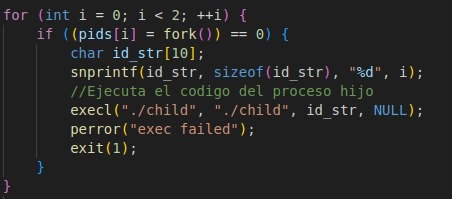

- Imprimelas opciones y contadores de la señal signit y los limpia, imprime el Conteo de llamadas al sistema, luego cierra y desvincula memoria compartida.

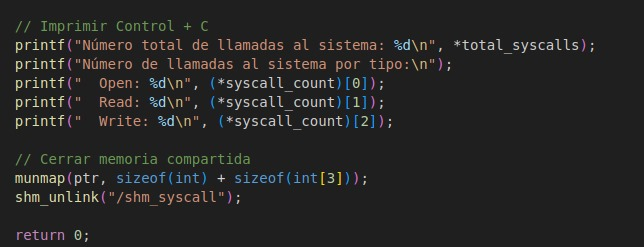

## Clase child
- Se utilizo las siguientes librerias: stdio.h, stdlib.h, unistd.h, fcntl.h, time.h, sys/types.h, sys/mman.h, sys/stat.h, string.h, signal.h. Estas bibliotecas proporcionan funciones y macros para manipulación de archivos.

- Luego define constantes y variables globales como lo es : DATA_FILE y CARACTERES que se utiliza para archivos asi se puede registrar las llamadas al sistema y datos  y el número de caracteres que se manejarán en cada operación de escritura. Y las variables globales para llevar registro de los contadores.

- La funcion handle_sigint establece la variable stop a 1 para señalizar que se realizo el control + c

- La funcion log_syscall abre el archivo syscalls.log y escribe una entrada con el PID del proceso, la llamada al sistema y la marca de tiempo actual.

- La funcion child_process instala el manejador de señales: Asocia la señal SIGINT con la función handle_sigint, luego inicializa el generador de números aleatorios, luego abre el archivo de datos: Abre el archivo practica1.txt en modo de lectura/escritura y creación, con permisos 0666, el archivo se abre en modo de apéndice; si hay un error al abrir el archivo, imprime un mensaje de error y termina el proceso.Luego registra la llamada al sistema open y por ultimo incrementa los contadores de llamadas al sistema.
Finalmente crea un bucle principal del hijo que mientras no se reciba la señal de interrupción realiza las operaciones como: decide aleatoriamente entre tres acciones posibles (open, read, write) y duerme entre 1 y 3 segundos, luego lee el archivo y si la acción es leer, lee 8 caracteres desde el principio del archivo y los imprime; tambien escribe en el archivo, registra la llamada al sistema correspondiente si es read o write y luego incrementa los contadores de llamadas al sistema, finalmente cierra el archivo.

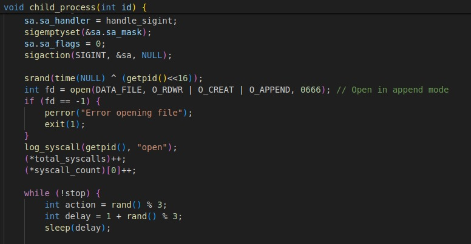
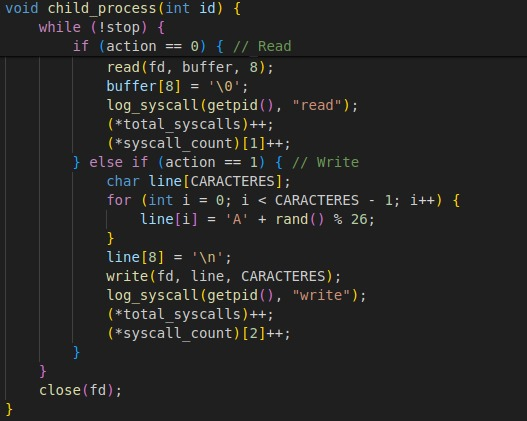

- La funcion main comprueba que se haya pasado un argumento, que es el ID del proceso hijo, luego convierte el argumento de ID de cadena a entero, crea memoria compartida, usa shm_open, mmap para abrir y mapear la memoria compartida que será utilizada por los procesos para compartir el conteo de llamadas al sistema.
Luego llama a la función del proceso hijo y finalmente termina el proceso.

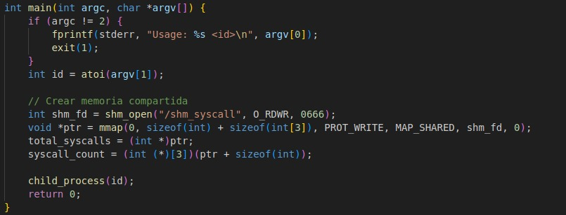

## Systemtap

Se utilizo esta herramienta para llevar el monitoreo de las llamadas al sistema que realizan los procesos hijos. Las llamadas al sistema son los siguientes:

- Read
- Write
- Open

Para realizar este monitoreo se ejecuto un script desde el programa. El algoritmo fue el siguiente:

1. Primero se obtiene el nombre del script y el id de los procesos hijos.

2. Luego se utiliza la funcion system() para ejecutar el comando. El comando para ejecutar un script de systemtap es el siguiente:

    "sudo stap syscalls_monitor.stp id_pocess id_process"

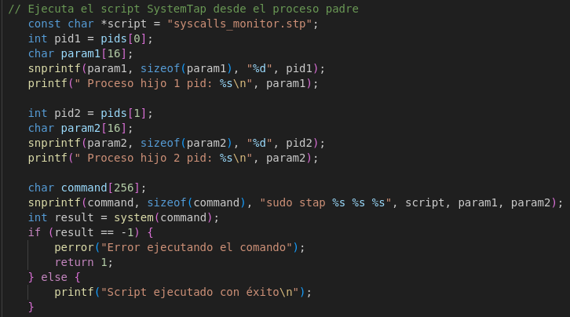

A continuacion se muestra el resultado en consola cuando se ejecuta el script:

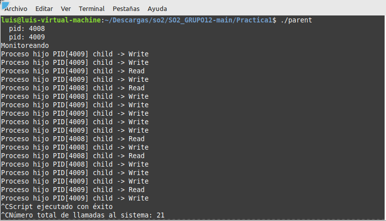

### Explicacion del archivo .stp

- Primero se debe especificar que el script sera ejecutado con systemtap

- Los bloques probe se ejecutaran cada vez que el sistema haga una llamada a read, write u open. Luego se encuentra una condicional para saber si el proceso es el hijo 1 o el hijo 2. Si la condicion se cumple se imprime en consola el pid y el nombre del ejecutable que realizo la llamada.

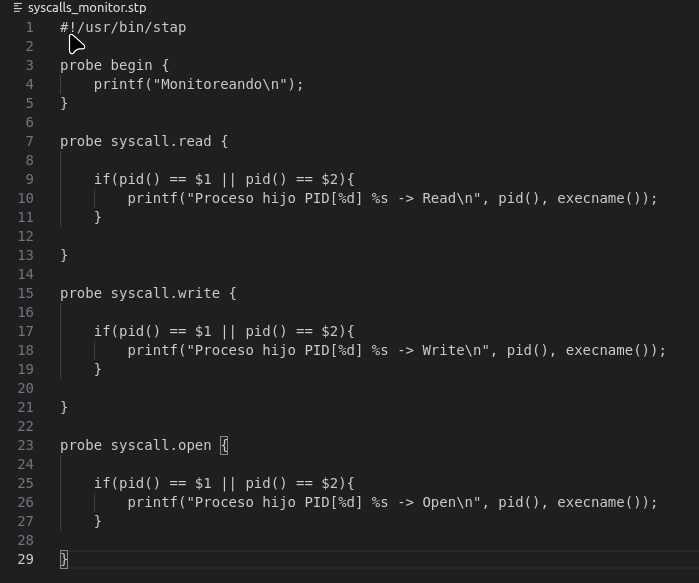
