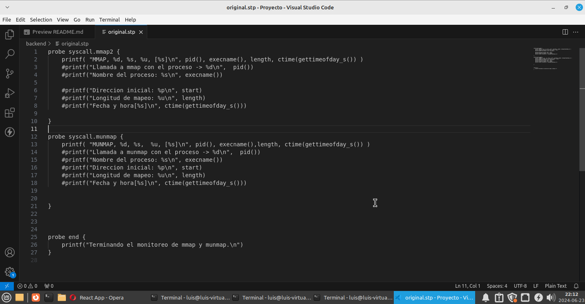
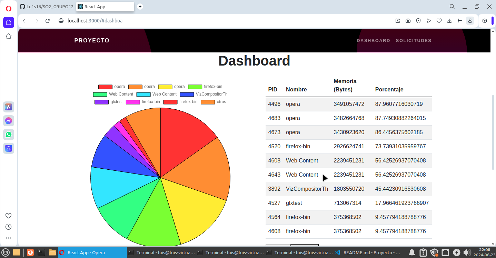

**Nombre Estudiante 1:** Luis Enrique Garcia Gutierrez
**Carnet Estudiante 1:** 202010814

**Nombre Estudiante 2:** Nataly Saraí Guzmán Duarte
**Carnet Estudiante 2:** 202001570

# Manual Tecnico 

## Backend

### Systemtap

En este script se hace dos llamadas. Una llamada a mmap() que crea una nueva asignacion en el espacio de direcciones virtuales del proceso de llamada. Aqui se obtiene la direccion inicial y la longitud de memoria. La llamada al sistema munmap() elimina las asignaciones para el rango de direcciones especificado.

Los datos que se recolecten por medio de estas llamadas se envian al codigo de C para ser procesaos y enviados a una base de datos en mysql. Los datos que se obtienen son los siguientes:
- Numero de proceso
- Nombre del proceso
- Tamaño de memoria
- Fecha y hora en que se realizo la llamada

A continuacion se muestra una imagen del script que se utilizo

### Base de datos
El programa en Go conecta a una base de datos MySQL llamada proyecto y escribe en una tabla llamada dashboards que tiene los campos pid que es int, nombre que es varchar(100), llamada que es varchar(100), tamanio que es int y fechayhora que es varchar(100). El programa debe leer las solicitudes del kernel, que incluyen el PID del proceso, el nombre del proceso, el tipo de llamada, el tamaño de memoria solicitado o liberado, y la fecha y hora de la solicitud. Luego, inserta esta información en la tabla dashboards, asegurando un registro preciso de las operaciones de memoria realizadas por los procesos del sistema.Además, se utiliza dbavear para monitorear y auditar el acceso y las operaciones en la base de datos, garantizando seguridad y eficiencia en la gestión de datos.

### Api
La clase server.go crea un servidor web en Go usando como framework gin-gonic,la cual esta se conecta a una base de datos MySQL para recuperar datos y exponerlos a través de una API RESTful. Tiene importaciones que incluyen paquetes necesarios para la conexión a la base de datos, manejo de solicitudes HTTP y el framework gin-gonic.
La función getDatos primero hace la conecta la base de datos MYSQL, luego ejecuta una consulta SQL para seleccionar datos de la tabla llamada Dashboard, itera sobre los resultados y los almacena en un arreglo de mapas y por ultimo los estructura en un formato JSON y los devuelve como respuesta a una solicitud GET en la ruta /datos.
En el main se configura el servidor para permitir solicitudes desde cualquier origen CORS y escucha en el puerto 8080.
El archivo go.mod define las dependencias del proyecto Go y la versión de Go utilizada, mientras que el archivo go.sum asegura la integridad de estas dependencias mediante hashes. go.mod lista los módulos requeridos y sus versiones, algunas de las cuales son indirectas (requeridas por otras dependencias), y go.sum contiene hashes que verifican que las versiones específicas de los módulos no han sido alteradas, garantizando así la seguridad y consistencia del entorno de desarrollo.

## Fronted 

Para el fronted se utilizo react. Aqui se obtienen los datos de mysql para ser mostrados a traves de tablas y graficas.

Se utilizo una grafica de Pie que muestra un maximo de 10 procesos y el porcentaje de memoria ram utilizado. 

En las tablas se muestra mas informacion de las llamadas, como el numero de pid, nombre, memoria y porcentaje. Al ser demasiados procesos los que se crean, solo se muestran 10 registros como maximo y por medio de un boton se pueden mostrar los demas procesos. 

A continuacion se muestran capturas de la aplicacion web.

